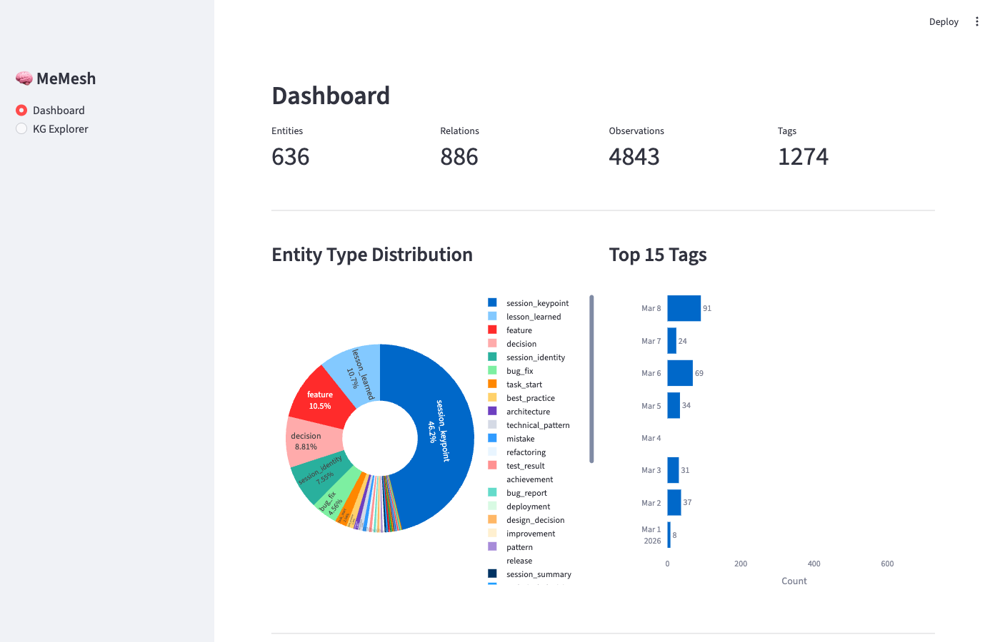
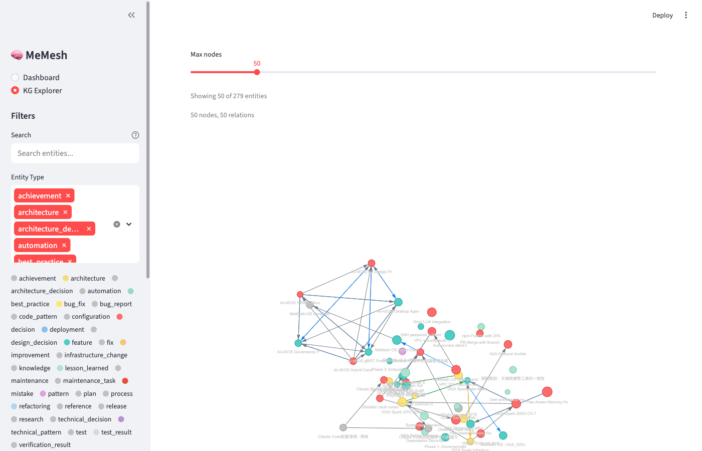
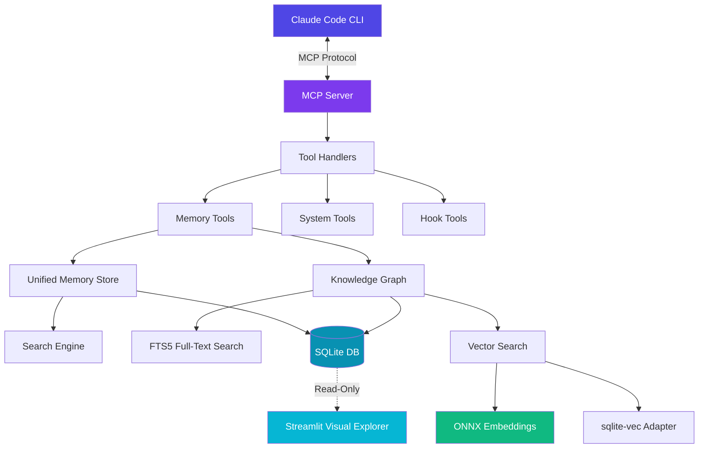
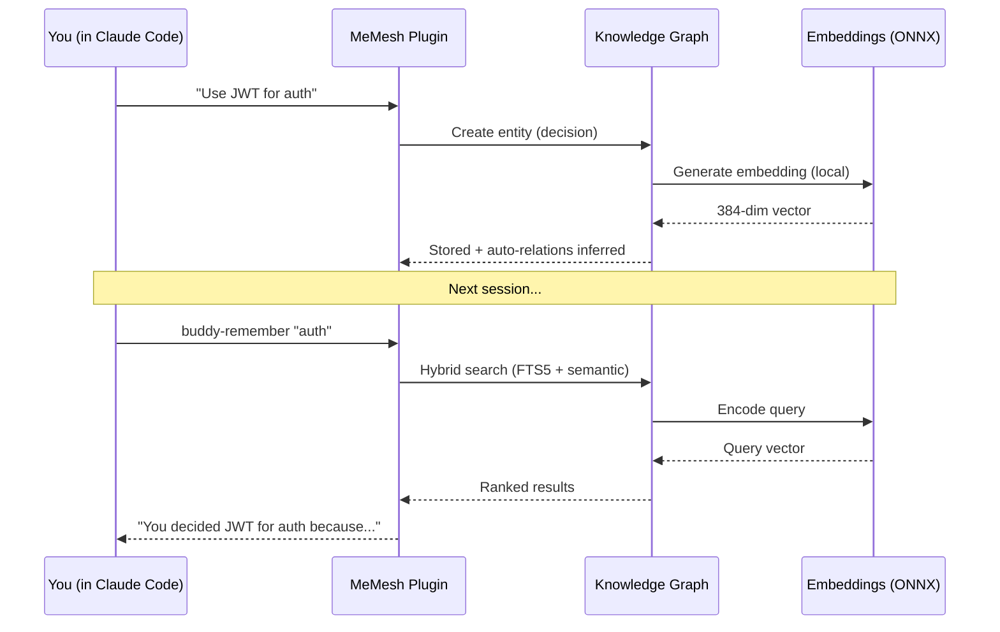

<div align="center">


# MeMesh Plugin

### Your AI coding sessions deserve memory.

MeMesh Plugin gives Claude Code persistent, searchable memory — so every session builds on the last.

[](https://www.npmjs.com/package/@pcircle/memesh)
[](https://www.npmjs.com/package/@pcircle/memesh)
[](LICENSE)
[](https://nodejs.org)
[](https://modelcontextprotocol.io)

```bash
npm install -g @pcircle/memesh
```

[Get Started](#get-started) · [How It Works](#how-it-works) · [Commands](#commands) · [Docs](docs/USER_GUIDE.md)

[繁體中文](README.zh-TW.md) · [简体中文](README.zh-CN.md) · [日本語](README.ja.md) · [한국어](README.ko.md) · [Français](README.fr.md) · [Deutsch](README.de.md) · [Español](README.es.md) · [Tiếng Việt](README.vi.md) · [ภาษาไทย](README.th.md) · [Bahasa Indonesia](README.id.md)

</div>

> **Note**: This project was originally called "Claude Code Buddy" and has been renamed to MeMesh Plugin to avoid potential trademark issues.

---

## The Problem

You're deep into a project with Claude Code. You made important decisions three sessions ago — which auth library, why you chose that database schema, what patterns to follow. But Claude doesn't remember. You repeat yourself. You lose context. You waste time.

**MeMesh Plugin fixes this.** It gives Claude a persistent, searchable memory that grows with your project.

---

## How It Works

<table>
<tr>
<td width="50%">

### Before MeMesh
```
Session 1: "Use JWT for auth"
Session 2: "Why did we pick JWT again?"
Session 3: "Wait, what auth library are we using?"
```
You repeat decisions. Claude forgets context. Progress stalls.

</td>
<td width="50%">

### After MeMesh
```
Session 1: "Use JWT for auth" → saved
Session 2: buddy-remember "auth" → instant recall
Session 3: Context auto-loaded on start
```
Every session picks up where you left off.

</td>
</tr>
</table>

---

## What You Get

**Searchable Project Memory** — Ask "what did we decide about auth?" and get an instant, semantically-matched answer. Not keyword search — *meaning* search, powered by local ONNX embeddings.

**Smart Task Analysis** — `buddy-do "add user auth"` doesn't just execute. It pulls relevant context from past sessions, checks what patterns you've established, and builds an enriched plan before writing a single line.

**Proactive Recall** — MeMesh automatically surfaces relevant memories when you start a session, hit a test failure, or encounter an error. No manual searching needed.

**Workflow Automation** — Session recaps on startup. File change tracking. Code review reminders before commits. All running silently in the background.

**Mistake Learning** — Record errors and fixes to build a knowledge base. The same mistake doesn't happen twice.

---

## Get Started

**Prerequisites**: [Claude Code](https://docs.anthropic.com/en/docs/claude-code) + Node.js 20+

```bash
npm install -g @pcircle/memesh
```

Restart Claude Code. That's it.

**Verify** — type in Claude Code:

```
buddy-help
```

You should see a list of available commands.

<details>
<summary><strong>Install from source</strong> (contributors)</summary>

```bash
git clone https://github.com/PCIRCLE-AI/claude-code-buddy.git
cd claude-code-buddy
npm install && npm run build
```

</details>

---

## Commands

| Command | What it does |
|---------|-------------|
| `buddy-do "task"` | Execute a task with full memory context |
| `buddy-remember "topic"` | Search past decisions and context |
| `buddy-help` | Show available commands |

**Real examples:**

```bash
# Get oriented in a new-to-you codebase
buddy-do "explain this codebase"

# Build features with context from past work
buddy-do "add user authentication"

# Recall why decisions were made
buddy-remember "API design decisions"
buddy-remember "why we chose PostgreSQL"
```

All data stays on your machine with automatic 90-day retention.

---

## How is this different from CLAUDE.md?

| | CLAUDE.md | MeMesh Plugin |
|---|-----------|--------|
| **Purpose** | Static instructions for Claude | Living memory that grows with your project |
| **Search** | Manual text search | Semantic search by meaning |
| **Updates** | You edit manually | Auto-captures decisions as you work |
| **Recall** | Always loaded (can get long) | Surfaces relevant context on demand |
| **Scope** | General preferences | Project-specific knowledge graph |

**They work together.** CLAUDE.md tells Claude *how* to work. MeMesh Plugin remembers *what* you've built.

---

## Platform Support

| Platform | Status |
|----------|--------|
| macOS | ✅ |
| Linux | ✅ |
| Windows | ✅ (WSL2 recommended) |

**Works with:** Claude Code CLI · VS Code Extension · Cursor (via MCP) · Any MCP-compatible editor

---

## Visual Explorer (Streamlit UI)

MeMesh Plugin includes an interactive web UI for exploring your knowledge graph visually.

**Dashboard** — Overview of your knowledge base with entity statistics, type distribution, tag trends, and growth over time.

<div align="center">

</div>

**KG Explorer** — Interactive graph visualization with color-coded entity types, relation edges, FTS5 full-text search, and filtering by type, tags, and date range.

<div align="center">

</div>

**Quick start:**

```bash
cd streamlit
pip install -r requirements.txt
streamlit run app.py
```

---

## Architecture



**How memory flows through the system:**



Everything runs locally. No cloud. No API calls. Your data never leaves your machine.

---

## Documentation

| Doc | Description |
|-----|-------------|
| [Getting Started](docs/GETTING_STARTED.md) | Step-by-step setup guide |
| [User Guide](docs/USER_GUIDE.md) | Full usage guide with examples |
| [Commands](docs/COMMANDS.md) | Complete command reference |
| [Architecture](docs/ARCHITECTURE.md) | Technical deep dive |
| [Contributing](CONTRIBUTING.md) | Contribution guidelines |
| [Development](docs/DEVELOPMENT.md) | Dev setup for contributors |

---

## Contributing

We welcome contributions! See [CONTRIBUTING.md](CONTRIBUTING.md) to get started.

---

## License

MIT — See [LICENSE](LICENSE)

---

<div align="center">

**Built with Claude Code, for Claude Code.**

[Report Bug](https://github.com/PCIRCLE-AI/claude-code-buddy/issues/new?labels=bug&template=bug_report.yml) · [Request Feature](https://github.com/PCIRCLE-AI/claude-code-buddy/discussions) · [Get Help](https://github.com/PCIRCLE-AI/claude-code-buddy/issues/new)

</div>
