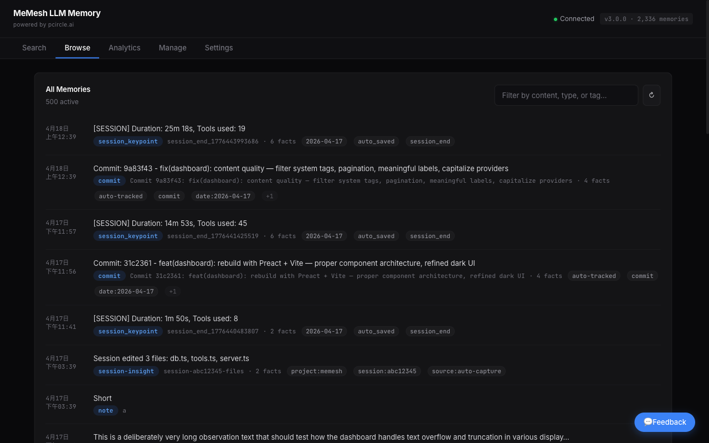

<p align="center">
  <h1 align="center">MeMesh LLM Memory</h1>
  <p align="center">
    <strong>The lightest universal AI memory layer.</strong><br />
    One SQLite file. Any LLM. Zero cloud.
  </p>
  <p align="center">
    <a href="https://www.npmjs.com/package/@pcircle/memesh"></a>
    <a href="LICENSE"></a>
    <a href="https://nodejs.org"></a>
    <a href="https://modelcontextprotocol.io"></a>
    <a href="https://pypi.org/project/memesh/"></a>
  </p>
</p>

---

Your AI forgets everything between sessions. **MeMesh fixes that.**

Install once, configure in 30 seconds, and every AI tool you use — Claude, GPT, LLaMA, or any MCP client — gets persistent, searchable, evolving memory. No cloud. No Neo4j. No vector database. Just one SQLite file.

```bash
npm install -g @pcircle/memesh
```

---

## Dashboard

<p align="center">
  
</p>

<p align="center">
  
</p>

<p align="center">
  
</p>

Run `memesh` to open the interactive dashboard with Search, Browse, Analytics, Manage, and Settings.

---

## Quick Start

```bash
# Store a memory
memesh remember --name "auth-decision" --type "decision" --obs "Use OAuth 2.0 with PKCE"

# Search memories (finds "OAuth" even if you search "login security" with Smart Mode)
memesh recall "login security"

# Archive outdated memories (soft-delete, never lost)
memesh forget --name "old-auth-design"

# Open the dashboard
memesh

# Start HTTP API (for Python SDK, integrations)
memesh serve
```

### Python

```python
from memesh import MeMesh

m = MeMesh()  # connects to localhost:3737
m.remember("auth", "decision", observations=["Use OAuth 2.0 with PKCE"])
results = m.recall("auth")
```

### Any LLM (OpenAI function calling format)

```bash
memesh export-schema --format openai
# → JSON array of tools, paste into your OpenAI/Claude/Gemini API call
```

---

## Why MeMesh?

Most AI memory solutions need Neo4j, vector databases, API keys, and 30+ minutes of setup. MeMesh needs **one command**.

| | **MeMesh** | Mem0 | Zep | Anthropic Memory |
|---|---|---|---|---|
| **Install** | `npm i -g` (5 sec) | pip + Neo4j + VectorDB | pip + Neo4j | Built-in (cloud) |
| **Storage** | Single SQLite file | Neo4j + Qdrant | Neo4j | Cloud |
| **Search** | FTS5 + scoring + LLM expansion | Semantic + BM25 | Temporal graph | Key lookup |
| **Privacy** | 100% local, always | Cloud option | Self-host | Cloud |
| **Dependencies** | 6 | 20+ | 10+ | 0 (but cloud-locked) |
| **Offline** | Yes | No | No | No |
| **Dashboard** | Built-in (5 tabs) | None | None | None |
| **Price** | Free | Free/Paid | Free/Paid | Included w/ API |

---

## Features

### 6 Memory Tools

| Tool | What it does |
|------|-------------|
| **remember** | Store knowledge with observations, relations, and tags |
| **recall** | Smart search with multi-factor scoring and LLM query expansion |
| **forget** | Soft-archive (never deletes) or remove specific observations |
| **consolidate** | LLM-powered compression of verbose memories |
| **export** | Share memories as JSON between projects or team members |
| **import** | Import memories with merge strategies (skip / overwrite / append) |

### 3 Access Methods

| Method | Command | Best for |
|--------|---------|----------|
| **CLI** | `memesh` | Terminal, scripting, CI/CD |
| **HTTP API** | `memesh serve` | Python SDK, dashboard, integrations |
| **MCP** | `memesh-mcp` | Claude Code, Claude Desktop, any MCP client |

### 4 Auto-Capture Hooks

| Hook | Trigger | What it captures |
|------|---------|-----------------|
| **Session Start** | Every session | Loads your top memories by relevance |
| **Post Commit** | After `git commit` | Records commit with diff stats |
| **Session Summary** | When Claude stops | Files edited, errors fixed, decisions made |
| **Pre-Compact** | Before compaction | Saves knowledge before context is lost |

### Smart Features

- **Knowledge Evolution** — `forget` archives, not deletes. `supersedes` relations replace old decisions with new ones. History is preserved.
- **Smart Recall** — LLM expands your search query into related terms. "login security" finds "OAuth PKCE".
- **Multi-Factor Scoring** — Results ranked by relevance (35%) + recency (25%) + frequency (20%) + confidence (15%) + temporal validity (5%).
- **Conflict Detection** — Warns when memories contradict each other.
- **Auto-Decay** — Stale memories (30+ days unused) gradually fade in ranking. Never deleted.
- **Namespaces** — `personal`, `team`, `global` scopes for organizing and sharing.

---

## Architecture

```
                    ┌─────────────────┐
                    │   Core Engine   │
                    │  (6 operations) │
                    └────────┬────────┘
           ┌─────────────────┼─────────────────┐
           │                 │                 │
     CLI (memesh)    HTTP API (serve)    MCP (memesh-mcp)
           │                 │                 │
           └─────────────────┼─────────────────┘
                             │
                    SQLite + FTS5 + sqlite-vec
                    (~/.memesh/knowledge-graph.db)
```

**Core** is framework-agnostic — the same `remember`/`recall`/`forget` logic runs identically whether invoked from terminal, HTTP, or MCP.

**Dependencies**: `better-sqlite3`, `sqlite-vec`, `@modelcontextprotocol/sdk`, `zod`, `express`, `commander`

---

## Development

```bash
git clone https://github.com/PCIRCLE-AI/memesh-llm-memory
cd memesh-llm-memory
npm install
npm run build
npm test -- --run    # 289 tests
```

Dashboard development:
```bash
cd dashboard
npm install
npm run dev          # Vite dev server with hot reload
npm run build        # Build to single HTML file
```

---

## License

MIT — [PCIRCLE AI](https://pcircle.ai)
