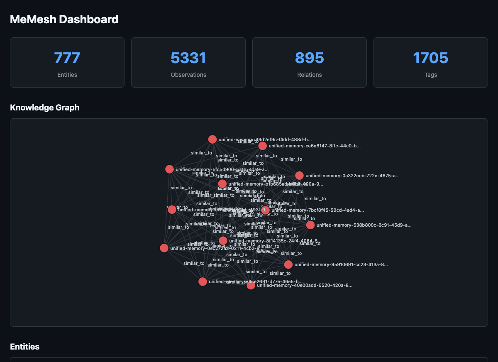

# MeMesh Plugin

Minimal persistent memory plugin for Claude Code. Remembers decisions, patterns, and context across sessions.

[](https://www.npmjs.com/package/@pcircle/memesh)
[](LICENSE)
[](https://nodejs.org)
[](https://modelcontextprotocol.io)

## Installation

```bash
npm install -g @pcircle/memesh
```

## What it does

MeMesh gives Claude Code persistent memory through 3 tools and 2 hooks:

### Tools

| Tool | Description |
|------|-------------|
| `remember` | Store knowledge -- decisions, patterns, lessons learned |
| `recall` | Search stored knowledge via full-text search |
| `forget` | Delete stored knowledge |

### Hooks

| Hook | When | What |
|------|------|------|
| Session Start | Every session | Auto-recalls relevant project memories |
| Post Commit | After git commits | Records commits as knowledge |

## How it works

- **Storage**: SQLite database at `~/.memesh/knowledge-graph.db`
- **Search**: FTS5 full-text search
- **Isolation**: Tag-based project filtering (`project:<name>`)
- **Schema**: Entities, Observations, Relations, Tags

## Architecture

```
src/
├── db.ts               # Database (open/close/migrate)
├── knowledge-graph.ts  # CRUD + FTS5 search
├── index.ts            # Package exports
└── mcp/
    ├── server.ts       # MCP server (stdio)
    └── tools.ts        # 3 tool handlers
```

Dependencies: `better-sqlite3`, `@modelcontextprotocol/sdk`, `zod`

## CLI Commands

| Command | Description |
|---------|-------------|
| `memesh-view` | Generate and open an interactive HTML dashboard showing a D3.js knowledge graph visualization, searchable entity table, and memory statistics |

Run after installing globally:

```bash
memesh-view
```



## Development

```bash
npm install
npm run build
npm test
npm run typecheck
```

## License

MIT
