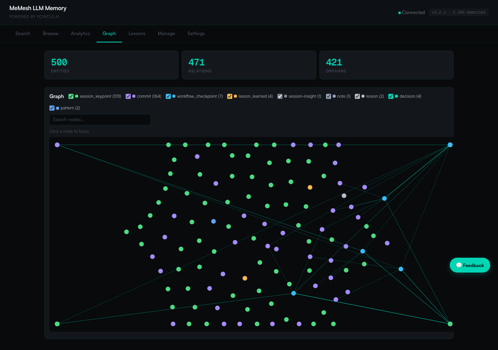

🌐 [English](README.md) | [繁體中文](README.zh-TW.md) | [简体中文](README.zh-CN.md) | [日本語](README.ja.md) | [한국어](README.ko.md) | [Português](README.pt.md) | [Français](README.fr.md) | [Deutsch](README.de.md) | [Tiếng Việt](README.vi.md) | [Español](README.es.md) | [ภาษาไทย](README.th.md)

<p align="center">
  <h1 align="center">MeMesh LLM Memory</h1>
  <p align="center">
    <strong>เลเยอร์หน่วยความจำ AI สากลที่เบาที่สุด</strong><br />
    ไฟล์ SQLite เดียว รองรับทุก LLM ไม่ต้องพึ่งคลาวด์
  </p>
  <p align="center">
    <a href="https://www.npmjs.com/package/@pcircle/memesh"></a>
    <a href="LICENSE"></a>
    <a href="https://nodejs.org"></a>
    <a href="https://modelcontextprotocol.io"></a>
  </p>
</p>

---

## ปัญหาที่เกิดขึ้น

AI ของคุณลืมทุกอย่างหลังจากจบแต่ละ session ทุกการตัดสินใจ ทุกการแก้บัก ทุกบทเรียนที่ได้รับ — หายไปหมด คุณต้องอธิบายบริบทเดิมซ้ำแล้วซ้ำเล่า Claude ค้นพบ pattern เดิมอีกครั้ง และความรู้ AI ของทีมก็รีเซ็ตกลับเป็นศูนย์ทุกครั้ง

**MeMesh มอบหน่วยความจำที่ยั่งยืน ค้นหาได้ และพัฒนาอยู่เสมอให้กับทุก AI**

---

## เริ่มต้นใน 60 วินาที

### ขั้นตอนที่ 1: ติดตั้ง

```bash
npm install -g @pcircle/memesh
```

### ขั้นตอนที่ 2: AI ของคุณจดจำ

```bash
memesh remember --name "auth-decision" --type "decision" --obs "Use OAuth 2.0 with PKCE"
```

### ขั้นตอนที่ 3: AI ของคุณเรียกคืน

```bash
memesh recall "login security"
# → ค้นพบ "OAuth 2.0 with PKCE" แม้จะค้นด้วยคำอื่น
```

**แค่นี้เอง** MeMesh เริ่มจดจำและเรียกคืนข้ามแต่ละ session แล้ว

เปิด dashboard เพื่อสำรวจหน่วยความจำของคุณ:

```bash
memesh
```

<p align="center">
  
</p>

<p align="center">
  
</p>

<p align="center">
  
</p>

---

## เหมาะสำหรับใคร?

| ถ้าคุณเป็น... | MeMesh ช่วยคุณ... |
|---------------|---------------------|
| **นักพัฒนาที่ใช้ Claude Code** | จดจำการตัดสินใจ pattern และบทเรียนข้าม session โดยอัตโนมัติ |
| **ทีมที่สร้างผลิตภัณฑ์ด้วย LLM** | แชร์ความรู้ของทีมผ่านการส่งออก/นำเข้า และรักษา AI context ของทุกคนให้สอดคล้องกัน |
| **นักพัฒนา AI agent** | มอบหน่วยความจำถาวรให้กับ agent ผ่าน MCP, HTTP API หรือ Python SDK |
| **ผู้ใช้ขั้นสูงที่มีเครื่องมือ AI หลายตัว** | เลเยอร์หน่วยความจำเดียวที่ใช้ได้กับ Claude, GPT, LLaMA, Ollama หรือ MCP client ใดก็ได้ |

---

## ทำงานร่วมกับทุกอย่าง

<table>
<tr>
<td width="33%" align="center">

**Claude Code / Desktop**
```bash
memesh-mcp
```
โปรโตคอล MCP (ตั้งค่าอัตโนมัติ)

</td>
<td width="33%" align="center">

**Python / LangChain**
```python
from memesh import MeMesh
m = MeMesh()
m.recall("auth")
```
`pip install memesh`

</td>
<td width="33%" align="center">

**ทุก LLM (รูปแบบ OpenAI)**
```bash
memesh export-schema \
  --format openai
```
วาง tools ลงใน API call ใดก็ได้

</td>
</tr>
</table>

---

## ทำไมไม่ใช้ Mem0 / Zep?

| | **MeMesh** | Mem0 | Zep |
|---|---|---|---|
| **เวลาติดตั้ง** | 5 วินาที | 30–60 นาที | 30+ นาที |
| **การตั้งค่า** | `npm i -g` — เสร็จ | Neo4j + VectorDB + API key | Neo4j + config |
| **การจัดเก็บ** | ไฟล์ SQLite เดียว | Neo4j + Qdrant | Neo4j |
| **ใช้ออฟไลน์ได้** | ได้ เสมอ | ไม่ได้ | ไม่ได้ |
| **Dashboard** | ในตัว (7 แท็บ + analytics) | ไม่มี | ไม่มี |
| **Dependencies** | 6 | 20+ | 10+ |
| **ราคา** | ฟรีตลอดชีพ | แผนฟรี / เสียเงิน | แผนฟรี / เสียเงิน |

**MeMesh แลกเปลี่ยน:** ฟีเจอร์ multi-tenant ระดับ enterprise เพื่อ**ติดตั้งทันที ไม่ต้องการ infrastructure และความเป็นส่วนตัว 100%**

---

## สิ่งที่เกิดขึ้นโดยอัตโนมัติ

คุณไม่ต้องจดจำทุกอย่างด้วยตัวเอง MeMesh มี **4 hook** ที่จับความรู้โดยที่คุณไม่ต้องทำอะไร:

| เมื่อไหร่ | MeMesh ทำอะไร |
|------|------------------|
| **ทุกครั้งที่เริ่ม session** | โหลดความจำที่เกี่ยวข้องมากที่สุด + การแจ้งเตือนเชิงรุกจากบทเรียนที่ผ่านมา |
| **หลังทุก `git commit`** | บันทึกสิ่งที่คุณเปลี่ยน พร้อมสถิติ diff |
| **เมื่อ Claude หยุดทำงาน** | จับไฟล์ที่แก้ไข บักที่แก้ไขแล้ว และสร้างบทเรียนที่มีโครงสร้างจากความล้มเหลวโดยอัตโนมัติ |
| **ก่อนการบีบอัด context** | บันทึกความรู้ก่อนที่จะหายไปเพราะข้อจำกัดของ context |

> **ปิดใช้งานได้ตลอดเวลา:** `export MEMESH_AUTO_CAPTURE=false`

---

## Dashboard

7 แท็บ, 11 ภาษา, ไม่มี dependency ภายนอก เข้าถึงที่ `http://localhost:3737/dashboard` เมื่อเซิร์ฟเวอร์ทำงาน

| แท็บ | สิ่งที่คุณเห็น |
|------|----------------|
| **Search** | ค้นหาเต็มรูปแบบ + ความคล้ายคลึงเชิงเวกเตอร์ในทุกความจำ |
| **Browse** | รายการแบบแบ่งหน้าของ entity ทั้งหมดพร้อมการเก็บถาวร/กู้คืน |
| **Analytics** | คะแนนสุขภาพหน่วยความจำ (0-100), ไทม์ไลน์ 30 วัน, ตัวชี้วัดมูลค่า, ความครอบคลุมของความรู้, คำแนะนำการทำความสะอาด, pattern การทำงาน |
| **Graph** | กราฟความรู้แบบโต้ตอบ force-directed พร้อมฟิลเตอร์ประเภท, ค้นหา, โหมด ego, heatmap ความใหม่ |
| **Lessons** | บทเรียนที่มีโครงสร้างจากความล้มเหลวในอดีต (ข้อผิดพลาด, สาเหตุหลัก, การแก้ไข, การป้องกัน) |
| **Manage** | เก็บถาวรและกู้คืน entity |
| **Settings** | ตั้งค่าผู้ให้บริการ LLM, เลือกภาษา |

---

## ฟีเจอร์อัจฉริยะ

**🧠 Smart Search** — ค้น "login security" แล้วพบความจำเกี่ยวกับ "OAuth PKCE" MeMesh ขยายคำค้นด้วยคำที่เกี่ยวข้องผ่าน LLM ที่ตั้งค่าไว้

**📊 Scored Ranking** — ผลลัพธ์จัดอันดับตาม ความเกี่ยวข้อง (35%) + ใช้ล่าสุดเมื่อไหร่ (25%) + ความถี่ (20%) + ความน่าเชื่อถือ (15%) + ข้อมูลยังทันสมัยหรือไม่ (5%)

**🔄 Knowledge Evolution** — การตัดสินใจเปลี่ยนแปลงได้ `forget` เก็บถาวรความจำเก่า (ไม่ลบจริงๆ) ความสัมพันธ์ `supersedes` เชื่อมโยงเก่ากับใหม่ AI ของคุณเห็นเวอร์ชันล่าสุดเสมอ

**⚠️ Conflict Detection** — ถ้ามีความจำสองอันที่ขัดแย้งกัน MeMesh จะแจ้งเตือน

**📦 Team Sharing** — `memesh export > team-knowledge.json` → แชร์กับทีม → `memesh import team-knowledge.json`

---

## เปิดใช้ Smart Mode (ไม่บังคับ)

MeMesh ทำงานออฟไลน์สมบูรณ์แบบโดยค่าเริ่มต้น เพิ่ม LLM API key เพื่อปลดล็อกการค้นหาที่ฉลาดขึ้น:

```bash
memesh config set llm.provider anthropic
memesh config set llm.api-key sk-ant-...
```

หรือใช้แท็บ Settings ใน dashboard (ตั้งค่าแบบ visual):

```bash
memesh  # เปิด dashboard → แท็บ Settings
```

| | ระดับ 0 (ค่าเริ่มต้น) | ระดับ 1 (Smart Mode) |
|---|---|---|
| **การค้นหา** | FTS5 keyword matching | + LLM query expansion (~97% recall) |
| **Auto-capture** | Pattern ตามกฎ | + LLM ดึงการตัดสินใจและบทเรียน |
| **การบีบอัด** | ไม่มี | `consolidate` บีบอัดความจำที่ยาวเกิน |
| **ค่าใช้จ่าย** | ฟรี ไม่ต้องใช้ API key | ~$0.0001 ต่อการค้นหา (Haiku) |

---

## เครื่องมือหน่วยความจำทั้ง 8 อย่าง

| เครื่องมือ | หน้าที่ |
|------|-------------|
| `remember` | บันทึกความรู้พร้อมการสังเกต ความสัมพันธ์ และแท็ก |
| `recall` | ค้นหาอัจฉริยะด้วย multi-factor scoring และการขยายคำค้นด้วย LLM |
| `forget` | เก็บถาวรแบบนุ่มนวล (ไม่ลบจริง) หรือลบการสังเกตเฉพาะ |
| `consolidate` | บีบอัดความจำที่ยืดเยื้อด้วย LLM |
| `export` | แชร์ความจำในรูปแบบ JSON ระหว่างโปรเจกต์หรือสมาชิกทีม |
| `import` | นำเข้าความจำด้วยกลยุทธ์การรวม (ข้าม / เขียนทับ / ต่อท้าย) |
| `learn` | บันทึกบทเรียนที่มีโครงสร้างจากข้อผิดพลาด (ข้อผิดพลาด, สาเหตุหลัก, การแก้ไข, การป้องกัน) |
| `user_patterns` | วิเคราะห์ pattern การทำงาน — ตารางเวลา, เครื่องมือ, จุดแข็ง, สิ่งที่ต้องเรียนรู้ |

---

## สถาปัตยกรรม

```
                    ┌─────────────────┐
                    │   Core Engine   │
                    │  (8 operations) │
                    └────────┬────────┘
           ┌─────────────────┼─────────────────┐
           │                 │                 │
     CLI (memesh)    HTTP API (serve)    MCP (memesh-mcp)
           │                 │                 │
           └─────────────────┼─────────────────┘
                             │
                    SQLite + FTS5 + sqlite-vec
                    (~/.memesh/knowledge-graph.db)
```

Core ไม่ขึ้นกับ framework ตรรกะเดียวกันทำงานจาก terminal, HTTP หรือ MCP

---

## การมีส่วนร่วม

```bash
git clone https://github.com/PCIRCLE-AI/memesh-llm-memory
cd memesh-llm-memory && npm install && npm run build
npm test -- --run    # 413 tests
```

Dashboard: `cd dashboard && npm install && npm run dev`

---

<p align="center">
  <strong>MIT</strong> — สร้างโดย <a href="https://pcircle.ai">PCIRCLE AI</a>
</p>
