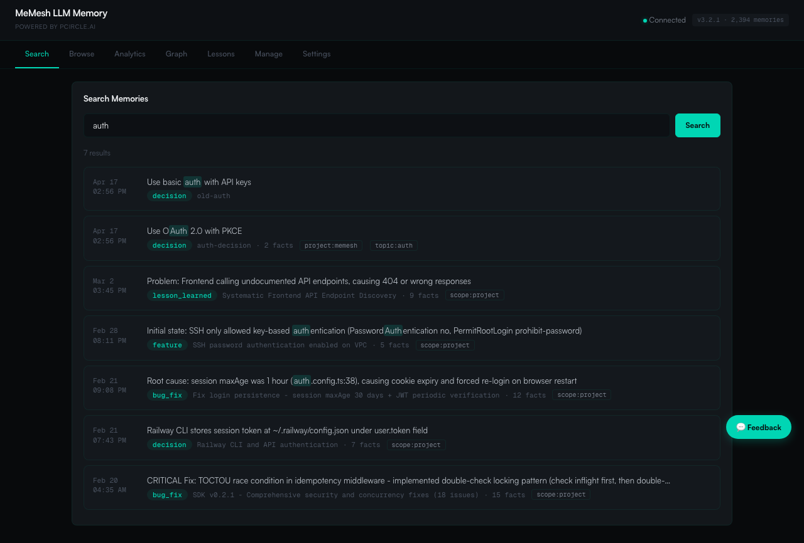
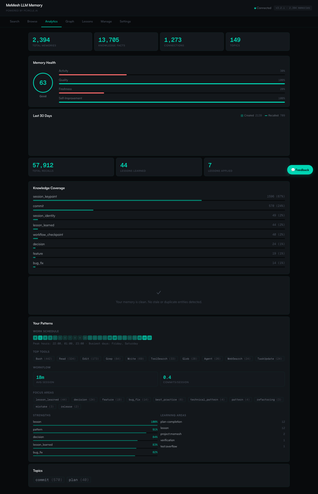

🌐 [English](README.md) | [繁體中文](README.zh-TW.md) | [简体中文](README.zh-CN.md) | [日本語](README.ja.md) | [한국어](README.ko.md) | [Português](README.pt.md) | [Français](README.fr.md) | [Deutsch](README.de.md) | [Tiếng Việt](README.vi.md) | [Español](README.es.md) | [ภาษาไทย](README.th.md)

<p align="center">
  <h1 align="center">MeMesh LLM Memory</h1>
  <p align="center">
    <strong>Lớp bộ nhớ AI phổ quát nhẹ nhất.</strong><br />
    Một file SQLite. Mọi LLM. Không cần đám mây.
  </p>
  <p align="center">
    <a href="https://www.npmjs.com/package/@pcircle/memesh"></a>
    <a href="LICENSE"></a>
    <a href="https://nodejs.org"></a>
    <a href="https://modelcontextprotocol.io"></a>
    <a href="https://pypi.org/project/memesh/"></a>
  </p>
</p>

---

## Vấn Đề

AI của bạn quên sạch mọi thứ sau mỗi phiên làm việc. Mọi quyết định, mọi lần sửa lỗi, mọi bài học rút ra — biến mất. Bạn phải giải thích lại cùng một bối cảnh, Claude lại khám phá lại cùng một pattern, và kiến thức AI của cả nhóm cứ reset về không mỗi lần.

**MeMesh trao cho mọi AI bộ nhớ bền vững, có thể tìm kiếm và không ngừng phát triển.**

---

## Bắt Đầu Trong 60 Giây

### Bước 1: Cài đặt

```bash
npm install -g @pcircle/memesh
```

### Bước 2: AI của bạn ghi nhớ

```bash
memesh remember --name "auth-decision" --type "decision" --obs "Use OAuth 2.0 with PKCE"
```

### Bước 3: AI của bạn gợi nhớ

```bash
memesh recall "login security"
# → Tìm thấy "OAuth 2.0 with PKCE" dù tìm bằng từ khác
```

**Vậy là xong.** MeMesh đã bắt đầu ghi nhớ và gợi nhớ xuyên suốt các phiên làm việc.

Mở dashboard để khám phá bộ nhớ của bạn:

```bash
memesh
```

<p align="center">
  
</p>

<p align="center">
  
</p>

---

## Dành Cho Ai?

| Nếu bạn là... | MeMesh giúp bạn... |
|---------------|---------------------|
| **Lập trình viên dùng Claude Code** | Tự động ghi nhớ quyết định, pattern và bài học qua các phiên làm việc |
| **Nhóm xây dựng sản phẩm với LLM** | Chia sẻ kiến thức nhóm qua xuất/nhập, giữ ngữ cảnh AI của mọi người đồng bộ |
| **Nhà phát triển AI agent** | Trao cho agent bộ nhớ bền vững qua MCP, HTTP API hoặc Python SDK |
| **Người dùng nặng với nhiều công cụ AI** | Một lớp bộ nhớ dùng được với Claude, GPT, LLaMA, Ollama hoặc bất kỳ MCP client nào |

---

## Tương Thích Với Tất Cả

<table>
<tr>
<td width="33%" align="center">

**Claude Code / Desktop**
```bash
memesh-mcp
```
Giao thức MCP (tự động cấu hình)

</td>
<td width="33%" align="center">

**Python / LangChain**
```python
from memesh import MeMesh
m = MeMesh()
m.recall("auth")
```
`pip install memesh`

</td>
<td width="33%" align="center">

**Mọi LLM (định dạng OpenAI)**
```bash
memesh export-schema \
  --format openai
```
Dán tools vào bất kỳ API call nào

</td>
</tr>
</table>

---

## Tại Sao Không Dùng Mem0 / Zep?

| | **MeMesh** | Mem0 | Zep |
|---|---|---|---|
| **Thời gian cài đặt** | 5 giây | 30–60 phút | 30+ phút |
| **Cấu hình** | `npm i -g` — xong | Neo4j + VectorDB + API key | Neo4j + config |
| **Lưu trữ** | Một file SQLite | Neo4j + Qdrant | Neo4j |
| **Hoạt động offline** | Có, luôn luôn | Không | Không |
| **Dashboard** | Tích hợp sẵn (5 tab) | Không có | Không có |
| **Phụ thuộc** | 6 | 20+ | 10+ |
| **Giá** | Miễn phí mãi mãi | Gói miễn phí / Trả phí | Gói miễn phí / Trả phí |

**MeMesh đánh đổi:** tính năng multi-tenant cấp doanh nghiệp để lấy **cài đặt tức thì, không hạ tầng, bảo mật 100%**.

---

## Những Gì Xảy Ra Tự Động

Bạn không cần phải tự ghi nhớ mọi thứ. MeMesh có **4 hook** tự động thu thập kiến thức mà không cần bạn làm gì:

| Khi nào | MeMesh làm gì |
|------|------------------|
| **Mỗi khi bắt đầu phiên** | Tải các ký ức liên quan nhất (xếp hạng theo thuật toán scoring) |
| **Sau mỗi `git commit`** | Ghi lại những gì bạn thay đổi, kèm thống kê diff |
| **Khi Claude kết thúc** | Thu thập file đã sửa, lỗi đã fix và quyết định đã đưa ra |
| **Trước khi nén context** | Lưu kiến thức trước khi mất do giới hạn context |

> **Tắt bất cứ lúc nào:** `export MEMESH_AUTO_CAPTURE=false`

---

## Tính Năng Thông Minh

**🧠 Tìm kiếm thông minh** — Tìm "login security" là ra ký ức về "OAuth PKCE". MeMesh mở rộng truy vấn bằng các thuật ngữ liên quan qua LLM đã cấu hình.

**📊 Xếp hạng theo điểm** — Kết quả được xếp hạng theo mức liên quan (35%) + thời gian sử dụng gần nhất (25%) + tần suất (20%) + độ tin cậy (15%) + thông tin còn hiệu lực không (5%).

**🔄 Tiến hóa kiến thức** — Quyết định thay đổi. `forget` lưu trữ ký ức cũ (không bao giờ xóa thật sự). Quan hệ `supersedes` nối cũ với mới. AI của bạn luôn thấy phiên bản mới nhất.

**⚠️ Phát hiện mâu thuẫn** — Nếu có hai ký ức mâu thuẫn nhau, MeMesh sẽ cảnh báo.

**📦 Chia sẻ nhóm** — `memesh export > team-knowledge.json` → chia sẻ với nhóm → `memesh import team-knowledge.json`

---

## Mở Khóa Chế Độ Thông Minh (Tùy Chọn)

MeMesh hoạt động hoàn toàn offline theo mặc định. Thêm API key của LLM để mở khóa tìm kiếm thông minh hơn:

```bash
memesh config set llm.provider anthropic
memesh config set llm.api-key sk-ant-...
```

Hoặc dùng tab Cài đặt trong dashboard (cấu hình trực quan):

```bash
memesh  # mở dashboard → tab Cài đặt
```

| | Cấp 0 (mặc định) | Cấp 1 (Chế độ thông minh) |
|---|---|---|
| **Tìm kiếm** | Khớp từ khóa FTS5 | + Mở rộng truy vấn bằng LLM (~97% recall) |
| **Tự động thu thập** | Pattern dựa trên quy tắc | + LLM trích xuất quyết định & bài học |
| **Nén** | Không có | `consolidate` nén ký ức dài dòng |
| **Chi phí** | Miễn phí, không cần API key | ~$0.0001 mỗi tìm kiếm (Haiku) |

---

## Tất Cả 6 Công Cụ Bộ Nhớ

| Công cụ | Chức năng |
|------|-------------|
| `remember` | Lưu kiến thức kèm quan sát, quan hệ và thẻ nhãn |
| `recall` | Tìm kiếm thông minh với scoring đa nhân tố và mở rộng truy vấn bằng LLM |
| `forget` | Lưu trữ mềm (không bao giờ xóa thật) hoặc xóa quan sát cụ thể |
| `consolidate` | Nén ký ức dài dòng bằng LLM |
| `export` | Chia sẻ ký ức dạng JSON giữa dự án hoặc thành viên nhóm |
| `import` | Nhập ký ức với chiến lược gộp (bỏ qua / ghi đè / nối thêm) |

---

## Kiến Trúc

```
                    ┌─────────────────┐
                    │   Core Engine   │
                    │  (6 operations) │
                    └────────┬────────┘
           ┌─────────────────┼─────────────────┐
           │                 │                 │
     CLI (memesh)    HTTP API (serve)    MCP (memesh-mcp)
           │                 │                 │
           └─────────────────┼─────────────────┘
                             │
                    SQLite + FTS5 + sqlite-vec
                    (~/.memesh/knowledge-graph.db)
```

Core độc lập với framework. Logic giống nhau chạy từ terminal, HTTP hoặc MCP.

---

## Đóng Góp

```bash
git clone https://github.com/PCIRCLE-AI/memesh-llm-memory
cd memesh-llm-memory && npm install && npm run build
npm test -- --run    # 289 tests
```

Dashboard: `cd dashboard && npm install && npm run dev`

---

<p align="center">
  <strong>MIT</strong> — Được tạo bởi <a href="https://pcircle.ai">PCIRCLE AI</a>
</p>
