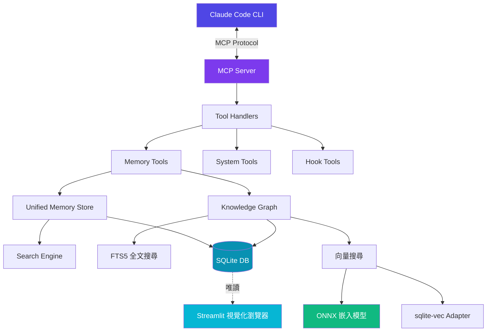
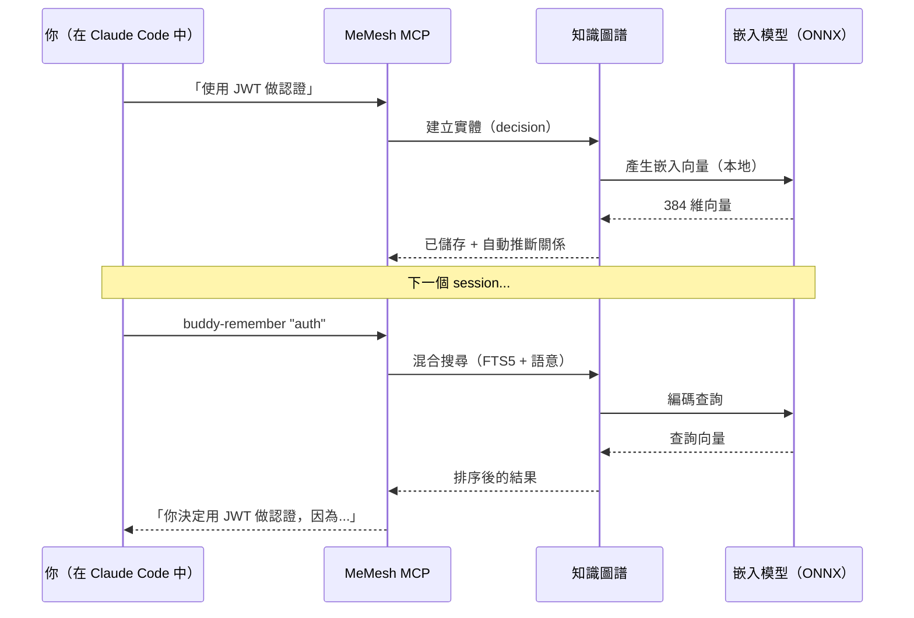

<div align="center">


# MeMesh Plugin

### 你的 AI 程式開發應該有記憶。

MeMesh Plugin 賦予 Claude Code 持久、可搜尋的記憶 — 讓每次對話都能延續上一次的成果。

[](https://www.npmjs.com/package/@pcircle/memesh)
[](https://www.npmjs.com/package/@pcircle/memesh)
[](LICENSE)
[](https://nodejs.org)
[](https://modelcontextprotocol.io)

```bash
npm install -g @pcircle/memesh
```

[開始使用](#開始使用) · [運作原理](#運作原理) · [指令](#指令) · [文件](docs/USER_GUIDE.md)

[English](README.md) · **繁體中文** · [简体中文](README.zh-CN.md) · [日本語](README.ja.md) · [한국어](README.ko.md) · [Français](README.fr.md) · [Deutsch](README.de.md) · [Español](README.es.md) · [Tiếng Việt](README.vi.md) · [ภาษาไทย](README.th.md) · [Bahasa Indonesia](README.id.md)

</div>

> **備註**：本專案原名「Claude Code Buddy」，為避免潛在的商標問題已更名為 MeMesh Plugin。

---

## 問題所在

你正在用 Claude Code 深入開發一個專案。三個 session 前你做了重要決策 — 用哪個 auth 函式庫、為什麼選了那個資料庫 schema、該遵循什麼模式。但 Claude 不記得了。你只能重複說明、失去脈絡、浪費時間。

**MeMesh 解決了這個問題。** 它賦予 Claude 持久、可搜尋的記憶，隨著你的專案一起成長。

---

## 運作原理

<table>
<tr>
<td width="50%">

### 沒有 MeMesh
```
Session 1: "用 JWT 做 auth"
Session 2: "我們當初為什麼選 JWT？"
Session 3: "等等，我們用的是哪個 auth 函式庫？"
```
你不斷重複決策。Claude 忘了脈絡。進度停滯。

</td>
<td width="50%">

### 有了 MeMesh
```
Session 1: "用 JWT 做 auth" → 已儲存
Session 2: buddy-remember "auth" → 即時回憶
Session 3: 啟動時自動載入脈絡
```
每次 session 都能接續上次的進度。

</td>
</tr>
</table>

---

## 你能獲得什麼

**可搜尋的專案記憶** — 問「我們之前怎麼決定 auth 的？」就能即時得到語意匹配的答案。不是關鍵字搜尋 — 而是*語意*搜尋，由本地 ONNX embeddings 驅動。

**智慧任務分析** — `buddy-do "加上使用者認證"` 不只是執行。它會從過去的 session 中提取相關脈絡、檢查你已建立的模式，在寫下任何一行程式碼之前先建構完整的計畫。

**主動回憶** — MeMesh 在你開始 session、遇到測試失敗或碰到錯誤時，自動浮現相關記憶。不需要手動搜尋。

**工作流自動化** — 啟動時顯示 session 回顧、追蹤檔案變更、commit 前提醒 code review。全部在背景靜靜運行。

**錯誤學習** — 記錄錯誤和修復方式來建立知識庫。同樣的錯誤不會再犯第二次。

---

## 開始使用

**前置需求**：[Claude Code](https://docs.anthropic.com/en/docs/claude-code) + Node.js 20+

```bash
npm install -g @pcircle/memesh
```

重啟 Claude Code，完成。

**驗證** — 在 Claude Code 中輸入：

```
buddy-help
```

你應該會看到可用指令的列表。

<details>
<summary><strong>從原始碼安裝</strong>（貢獻者）</summary>

```bash
git clone https://github.com/PCIRCLE-AI/claude-code-buddy.git
cd claude-code-buddy
npm install && npm run build
```

</details>

---

## 指令

| 指令 | 功能說明 |
|------|----------|
| `buddy-do "任務"` | 帶著完整記憶脈絡執行任務 |
| `buddy-remember "主題"` | 搜尋過去的決策和脈絡 |
| `buddy-help` | 顯示可用指令 |

**實際範例：**

```bash
# 快速了解一個不熟悉的 codebase
buddy-do "explain this codebase"

# 帶著過去工作的脈絡來開發功能
buddy-do "add user authentication"

# 回顧決策的原因
buddy-remember "API design decisions"
buddy-remember "why we chose PostgreSQL"
```

所有資料都存在你的電腦上，統一採用 90 天自動保留機制。

---

## 這跟 CLAUDE.md 有什麼不同？

| | CLAUDE.md | MeMesh |
|---|-----------|--------|
| **用途** | 給 Claude 的靜態指令 | 隨專案成長的活記憶 |
| **搜尋** | 手動文字搜尋 | 依語意搜尋 |
| **更新** | 你手動編輯 | 工作時自動捕捉決策 |
| **回憶** | 永遠載入（可能變很長） | 按需浮現相關脈絡 |
| **範圍** | 一般偏好設定 | 專案專屬的知識圖譜 |

**它們可以搭配使用。** CLAUDE.md 告訴 Claude *如何*工作。MeMesh 記住你*建了什麼*。

---

## 平台支援

| 平台 | 狀態 |
|------|------|
| macOS | ✅ |
| Linux | ✅ |
| Windows | ✅ (建議 WSL2) |

**可搭配使用：** Claude Code CLI · VS Code Extension · Cursor (透過 MCP) · 任何相容 MCP 的編輯器

---

## 視覺化瀏覽器（Streamlit UI）

MeMesh 內建互動式 Web UI，讓你直觀地探索知識圖譜。

**Dashboard** — 知識庫總覽，包含實體統計、類型分佈、標籤趨勢與成長曲線。

<div align="center">

</div>

**KG Explorer** — 互動式圖譜視覺化，支援按顏色區分實體類型、關係連線、FTS5 全文搜尋，以及按類型、標籤和日期範圍篩選。

<div align="center">

</div>

**快速啟動：**

```bash
cd streamlit
pip install -r requirements.txt
streamlit run app.py
```

---

## 架構



**記憶如何在系統中流動：**



一切在本地運行。沒有雲端。沒有 API 呼叫。你的資料永遠不會離開你的電腦。

---

## 文件

| 文件 | 說明 |
|------|------|
| [快速開始](docs/GETTING_STARTED.md) | 一步步的安裝指南 |
| [使用指南](docs/USER_GUIDE.md) | 完整使用指南與範例 |
| [指令參考](docs/COMMANDS.md) | 完整的指令參考 |
| [架構說明](docs/ARCHITECTURE.md) | 技術深入解析 |
| [貢獻指南](CONTRIBUTING.md) | 貢獻者指南 |
| [開發指南](docs/DEVELOPMENT.md) | 給貢獻者的開發設定 |

---

## 貢獻

歡迎貢獻！請參閱 [CONTRIBUTING.md](CONTRIBUTING.md) 開始。

---

## 授權

MIT — 詳見 [LICENSE](LICENSE)

---

<div align="center">

**用 Claude Code 打造，為 Claude Code 而生。**

[回報 Bug](https://github.com/PCIRCLE-AI/claude-code-buddy/issues/new?labels=bug&template=bug_report.yml) · [功能請求](https://github.com/PCIRCLE-AI/claude-code-buddy/discussions) · [取得協助](https://github.com/PCIRCLE-AI/claude-code-buddy/issues/new)

</div>
