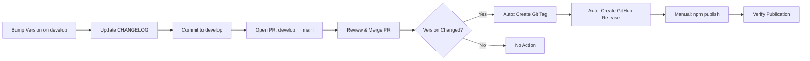

# MeMesh Plugin Release Process

This document describes the complete release process for MeMesh Plugin, including versioning, changelog maintenance, and automated publishing.

## Overview

MeMesh uses a **branch-based release** workflow. All development happens on `develop` or feature branches — **never push directly to `main`**. When a release is ready, a PR from `develop → main` triggers the release pipeline.

1. Develop on `develop` or `feature/*` branches
2. Open PR to merge into `main`
3. After merge, GitHub Actions detects the version change
4. Auto: Creates git tag + GitHub Release
5. **Manual step**: Publish to npm (requires manual `npm publish`)

**Why Manual npm Publish?**

The auto-release workflow uses `GITHUB_TOKEN` to create releases. Due to GitHub's anti-loop protection, workflows triggered by `GITHUB_TOKEN` cannot trigger other workflows. This prevents the `publish-npm` workflow from auto-triggering. Manual publishing ensures full control over the npm publication process.

## Git Branch Strategy

```
main        ← production-ready, protected, merge via PR only
develop     ← integration branch for ongoing work
feature/*   ← short-lived feature/fix branches off develop
```

**Rules**:
- **NEVER** push directly to `main` — always use a PR
- `develop` is the default working branch
- Feature branches merge into `develop` via PR or direct push
- `develop` merges into `main` via PR for releases

## Release Workflow



## Step-by-Step Guide

### 1. Prepare Release

#### Check Current State

```bash
# Ensure working directory is clean
git status

# Pull latest changes
git pull origin main

# Check current version
npm version
```

#### Run Full Test Suite

```bash
# Build
npm run build

# Run all tests
npm test

# Run installation tests
npm run test:install

# Type check
npm run typecheck

# Linting
npm run lint
```

All tests must pass before proceeding.

### 2. Version Bump

Choose the appropriate version bump:

- **Patch** (X.Y.Z → X.Y.Z+1): Bug fixes, minor improvements
- **Minor** (X.Y.Z → X.Y+1.0): New features, backward compatible
- **Major** (X.Y.Z → X+1.0.0): Breaking changes

```bash
# Patch release (most common)
npm version patch --no-git-tag-version

# Minor release
npm version minor --no-git-tag-version

# Major release
npm version major --no-git-tag-version
```

**Note**: We use `--no-git-tag-version` because GitHub Release creates the tag.

### 3. Update CHANGELOG.md

Add a new entry following [Keep a Changelog](https://keepachangelog.com/) format:

```markdown
## [X.Y.Z] - YYYY-MM-DD

### Added
- New features

### Changed
- Changes in existing functionality

### Deprecated
- Soon-to-be removed features

### Removed
- Removed features

### Fixed
- Bug fixes

### Security
- Security fixes
```

**Example**:
```markdown
## [2.6.6] - 2026-02-03

### Fixed
- GitHub Actions npm publish workflow - replaced invalid GitHub API method with logging
- Fixed workflow comment step that was causing publish failures
```

### 4. Commit Changes on `develop`

```bash
git checkout develop
git add package.json CHANGELOG.md
git commit -m "chore(release): bump version to X.Y.Z

- Brief description of changes
- Reference to issues/PRs if applicable

Co-Authored-By: Claude Sonnet 4.5 <noreply@anthropic.com>"
git push origin develop
```

### 5. Open PR: `develop` → `main`

**NEVER push directly to `main`.** Always use a Pull Request.

```bash
# Create PR using GitHub CLI
gh pr create --base main --head develop \
  --title "chore(release): v X.Y.Z" \
  --body "## Release X.Y.Z

- Summary of changes
- See CHANGELOG.md for details"
```

Or create the PR via the GitHub web interface.

### 6. Review & Merge PR

1. Verify CI checks pass on the PR
2. Review the changes
3. **Merge the PR** (squash or merge commit)

**⏳ Wait for Auto-Release** — After merge, GitHub Actions will:
1. Detect the version change in `package.json`
2. Extract changelog for the new version
3. Create a git tag `vX.Y.Z`
4. Create a GitHub Release with changelog

You can monitor the progress in GitHub Actions.

### 7. Manual npm Publish

After the auto-release workflow completes (usually 1-2 minutes), manually publish to npm:

```bash
# Publish to npm
npm publish --access public

# Verify publication
npm view @pcircle/memesh version
```

**Why Manual?** The auto-release workflow uses `GITHUB_TOKEN`, which cannot trigger the npm publish workflow due to GitHub's anti-loop protection. Manual publishing ensures controlled npm publication.

### 8. Monitor Automated Release Creation

#### Using GitHub CLI

```bash
# Watch the auto-release workflow
gh run watch --repo PCIRCLE-AI/claude-code-buddy

# Or list recent runs
gh run list --workflow=auto-release.yml --limit 3
```

#### Using GitHub Web Interface

1. Go to https://github.com/PCIRCLE-AI/claude-code-buddy/actions
2. Check the "Auto Release" workflow
3. Verify tag creation and release creation steps succeed
4. Then check "Publish to npm" workflow

### 9. Automated Release Creation

The auto-release workflow (.github/workflows/auto-release.yml) is triggered when `package.json` is pushed to main:

1. **Check Version Change**
   - Compares current vs. previous package.json version
   - Skips if version unchanged

2. **Create Release** (if version changed):
   ```yaml
   ✓ Extract changelog for version
   ✓ Create annotated git tag
   ✓ Push tag to GitHub
   ✓ Create GitHub Release with changelog
   ```

3. **Expected Duration**: ~1-2 minutes

**Note**: The publish-npm workflow exists but is NOT automatically triggered due to GitHub's token limitations. npm publication must be done manually (see step 6).

### 10. Monitor Workflows

#### Using GitHub CLI

```bash
# Watch auto-release workflow
gh run watch --workflow=auto-release.yml

# Or list recent workflow runs
gh run list --workflow=auto-release.yml --limit 3
```

#### Using GitHub Web Interface

1. Go to https://github.com/PCIRCLE-AI/claude-code-buddy/actions
2. Check "Auto Release" workflow
3. Verify all steps complete successfully (tag and release creation)

### 11. Verify Publication

#### Check npm Registry

```bash
# Check latest version
npm view @pcircle/memesh version

# Check all versions
npm view @pcircle/memesh versions

# Check package metadata
npm view @pcircle/memesh
```

#### Test Installation

```bash
# Install globally
npm install -g @pcircle/memesh@latest

# Verify version
memesh --version

# Check help
memesh --help
```

## Troubleshooting

### Auto Release Workflow Fails

1. **Check workflow logs**:
   ```bash
   gh run view --workflow=auto-release.yml --log-failed
   ```

2. **Common issues**:
   - **Version not detected**: Check package.json was actually modified
   - **Tag already exists**: Delete the tag first (`git push --delete origin vX.Y.Z`)
   - **CHANGELOG extraction fails**: Ensure CHANGELOG.md follows the format `## [X.Y.Z]`
   - **Permission denied**: Check workflow has `contents: write` permission

3. **Manual fallback** (if auto-release fails):
   ```bash
   # Create tag manually
   git tag -a vX.Y.Z -m "Release vX.Y.Z"
   git push origin vX.Y.Z

   # Create release manually
   gh release create vX.Y.Z --title "vX.Y.Z" --notes-file CHANGELOG.md
   ```

### Manual npm Publish Fails

1. **Common issues**:
   - **Version already published (403)**: Version already exists on npm
   - **Authentication fails**: Not logged in or token expired
   - **Permission denied**: Account doesn't have publish rights for @pcircle scope

2. **Solutions**:

   **Already published**:
   ```bash
   # Bump to next version
   npm version patch --no-git-tag-version

   # Update CHANGELOG, commit, push
   git add package.json CHANGELOG.md
   git commit -m "chore(release): bump version to X.Y.Z+1"
   git push origin main

   # Wait for auto-release to create new release
   # Then publish manually
   npm publish --access public
   ```

   **Authentication issues**:
   ```bash
   # Check current login
   npm whoami

   # Login if needed
   npm login

   # Then retry publish
   npm publish --access public
   ```

### Version Already Published

If you see:
```
npm error 403 Forbidden - You cannot publish over the previously published versions: X.Y.Z
```

**Solution**: Bump to next version and publish again. npm does not allow overwriting published versions.

### NPM_TOKEN Issues

If authentication fails:
1. Verify `NPM_TOKEN` secret exists in repository settings
2. Check token has not expired
3. Ensure token has publish permissions for `@pcircle` scope

## GitHub Actions Workflow Details

### Workflow Files

MeMesh uses two automated workflows:

#### 1. Auto Release Workflow

**Location**: `.github/workflows/auto-release.yml`

**Trigger**: Push to main branch with package.json changes
```yaml
on:
  push:
    branches: [main]
    paths: ['package.json']
```

**Key Features**:
- Detects version changes automatically
- Extracts changelog from CHANGELOG.md
- Creates annotated git tags
- Creates GitHub Releases with proper notes
- Runs only when version actually changes

**Permissions**: `contents: write` (to create tags and releases)

#### 2. NPM Publish Workflow (Not Auto-Triggered)

**Location**: `.github/workflows/publish-npm.yml`

**Intended Trigger**: When GitHub Release is published
```yaml
on:
  release:
    types: [published]
```

**Status**: ⚠️ **Not automatically triggered** due to GitHub's anti-loop protection. Releases created by `GITHUB_TOKEN` don't trigger other workflows.

**Workaround**: Manual `npm publish` after auto-release completes (see step 6).

**If This Workflow Runs** (e.g., manual release creation):
- **Provenance**: Publishes with `--provenance` for supply chain security
- **Public Access**: Uses `--access public` for scoped package
- **Test Integration**: Runs full test suite including installation tests
- **Package Verification**: Checks package contents before publishing

## Best Practices

### Version Numbering

Follow [Semantic Versioning 2.0.0](https://semver.org/):

- **MAJOR**: Breaking changes (X.0.0)
- **MINOR**: New features, backward compatible (0.X.0)
- **PATCH**: Bug fixes (0.0.X)

### Release Frequency

- **Patch releases**: As needed for urgent fixes
- **Minor releases**: When significant features are ready
- **Major releases**: When breaking changes are necessary

### Release Notes

Good release notes include:
- **What changed**: Clear description of changes
- **Why it matters**: Impact on users
- **Migration guide**: For breaking changes
- **Credits**: Acknowledge contributors

### Testing Before Release

Always test:
1. ✅ Local build succeeds
2. ✅ All unit tests pass
3. ✅ Integration tests pass
4. ✅ Installation test passes
5. ✅ Type checking passes
6. ✅ Linting passes

### CHANGELOG Maintenance

- Update CHANGELOG.md for every release
- Group changes by category (Added, Changed, Fixed, etc.)
- Write user-facing descriptions (not technical details)
- Link to relevant issues/PRs

## Emergency Rollback

If a release has critical issues:

1. **Do NOT unpublish from npm** (breaks dependent projects)

2. **Instead, publish a hotfix**:
   ```bash
   # Fix the issue
   # Bump version
   npm version patch --no-git-tag-version

   # Update CHANGELOG with fix
   # Commit and release
   ```

3. **Or deprecate the version**:
   ```bash
   npm deprecate @pcircle/memesh@X.Y.Z "Critical bug, use X.Y.Z+1 instead"
   ```

## Release Checklist

Use this checklist for every release:

### Manual Steps (You Do)
- [ ] Pull latest `develop` branch
- [ ] All tests pass locally
- [ ] Version bumped in package.json (using `npm version`)
- [ ] CHANGELOG.md updated with changes
- [ ] Changes committed and pushed to `develop`
- [ ] PR opened: `develop` → `main`
- [ ] PR reviewed and merged

### Automated Steps (GitHub Actions Does)
- [ ] ✨ Auto Release workflow detects version change
- [ ] ✨ Git tag created automatically
- [ ] ✨ GitHub Release created with changelog

### Manual Steps (You Do After Auto-Release)
- [ ] Wait for auto-release workflow to complete (~1-2 minutes)
- [ ] Run `npm publish --access public`
- [ ] Verify publication with `npm view @pcircle/memesh version`

### Verification Steps (Final Check)
- [ ] Auto-release workflow completed successfully
- [ ] Version verified on npm registry
- [ ] Installation tested (`npm install -g @pcircle/memesh@latest`)
- [ ] Documentation updated (if needed)
- [ ] Announcement posted (if major release)

## References

- [npm Documentation](https://docs.npmjs.com/)
- [GitHub Actions - Publishing Node.js packages](https://docs.github.com/en/actions/publishing-packages/publishing-nodejs-packages)
- [Semantic Versioning](https://semver.org/)
- [Keep a Changelog](https://keepachangelog.com/)
- [Conventional Commits](https://www.conventionalcommits.org/)

## Questions?

- Check [GitHub Discussions](https://github.com/PCIRCLE-AI/claude-code-buddy/discussions)
- Open an [Issue](https://github.com/PCIRCLE-AI/claude-code-buddy/issues)
